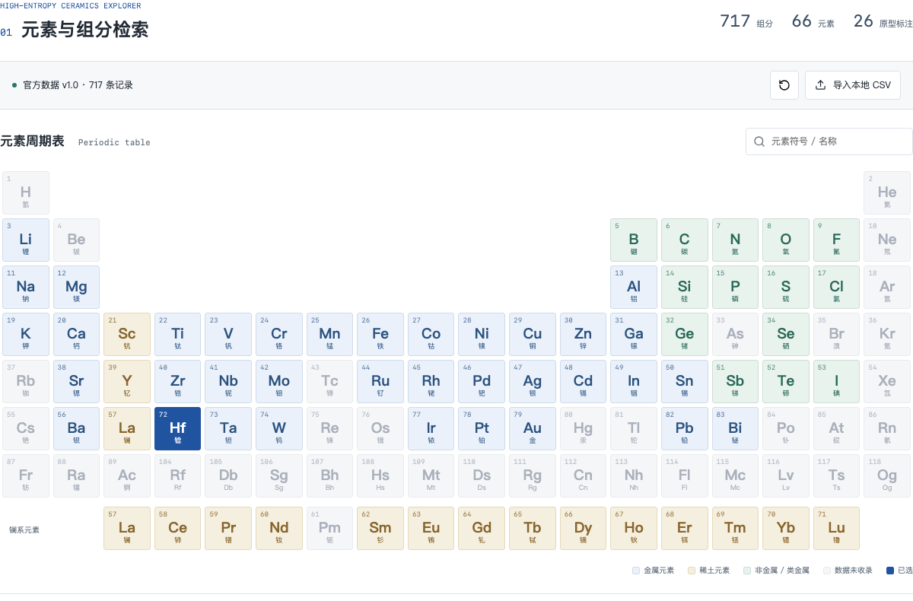

# JNIST Research Gateway

济南超级计算技术研究院的科研成果与数据资源网站。

[访问网站](https://research.jnist.cn/) · [研究院官网](https://www.jnist.cn/)

网站支持中英文，可根据浏览器语言自动选择。

## 研究资源

### 高熵陶瓷数据库

面向原子尺度模拟与材料设计，收录高熵陶瓷组分、晶体结构及来源文献。目前包含 717 条组分记录，覆盖 66 种元素，提供 671 份 CIF 结构及对应的弛豫超胞。

在元素周期表上选择元素，即可筛选组分、查阅文献并下载结构文件。筛选结果可导出为 CSV，也支持导入本地数据进行检索。

[打开数据库](https://research.jnist.cn/2026/hec/)



## 参与开发

本地运行：

```sh
nvm install
nvm use
npm ci
npm run dev
```

内容更新见[维护文档](docs/adding-research.md)，部署方式见[部署文档](docs/deployment.md)，数据与图片的来源见[资源说明](docs/asset-sources.md)。

问题反馈和改进建议请提交到 [Issues](https://github.com/jnist/research-gateway/issues)，也欢迎通过 Pull Request 参与。
